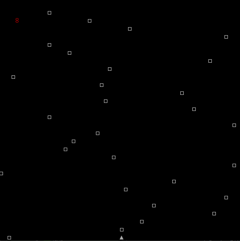
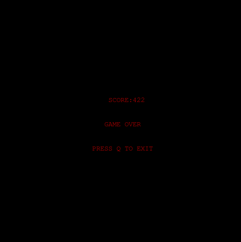

# LPOO_T5G2 - Cubefield
Our game is a 2D demake inspired by Cubefield, shown below. Cubefield is an endless runner game where the players' reactions are tested in order to avoid colliding with fast moving blocks.

The following is a screenshot representative of the current state of the game:

