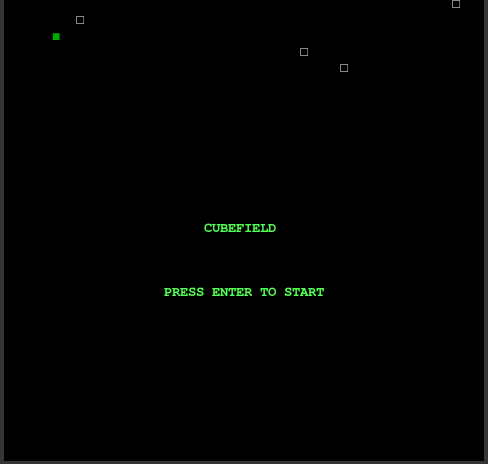

# LPOO_T5G2 - Cubefield
Our game is a 2D demake inspired by Cubefield, shown at the end. Cubefield is an endless runner game where the players' reactions are tested in order to avoid colliding with fast moving blocks.

The following video is representative of the current game state loop:

