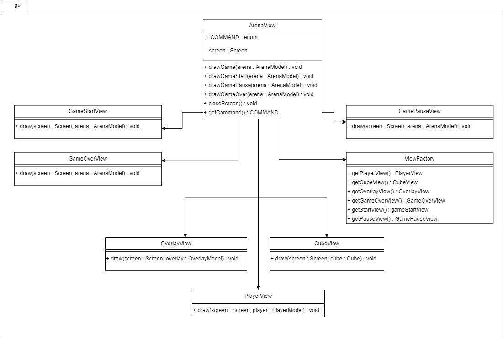
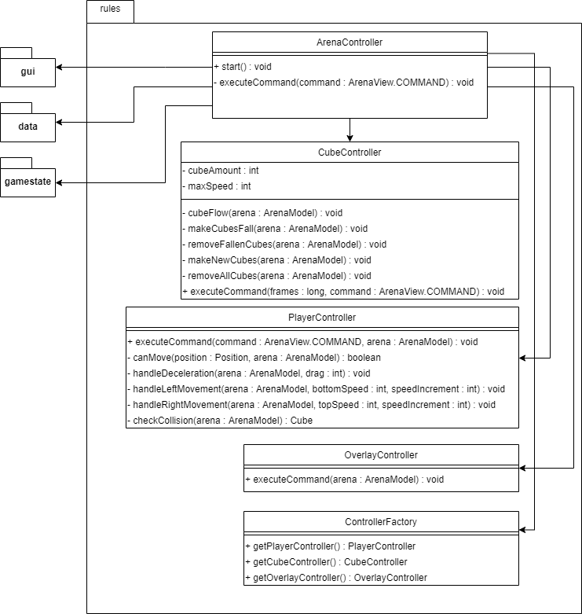

# LPOO_T5G2 - Cubefield
Our game is inspired by Cubefield. Cubefield is an endless runner game where the players' reactions are tested in order to avoid colliding with fast moving blocks.

## Features
### Implemented:
- **Movement** 

    • the character moves horizontally according to input (left or right keys)
    
    • the character has **weight** due to acceleration and drag implementation; Makes the player's movement more natural
    
    • cubes fall with **adjustable speed**
    
    
- **Gameplay** 

    • The **first menu** the player is presented shows what the game looks like when playing and asks the player to **press Enter** to start
    
    • After pressing enter, cubes start falling: **good cubes** (in green) and **bad cubes** (the hollow cube boxes)
    
    • By pressing Enter the player can **pause the game** in its current state; To **resume the game** the player can press Enter again
    
    • When the player loses a **Game Over menu** appears: this menu allows the player to press Enter to **play again** or Q to **exit the game** 
    
    
- **Score** 

    • During the course of the game **score is kept track in real-time** and displayed in an overlay on the top left corner of the screen
    
    • When the **player loses** his score is also shown in the **Game Over menu**
    
    
- **Collisions** 

    • **Collisions are being detected**, both when colliding the good cubes and the bad cubes;
    
    • When colliding with a **bad cube**, the player **loses** the game instantly
    
    • When colliding with a **good cube**, the player gets **bonus points** added to his current score
    

## Design

---

### Problem in Context - MVC Pattern
There was a considerable amount of too tightly coupled code, accompanied by classes with too much responsibility. The lack of modularity caused both difficulty extending functionality and unit testing the code.
### The pattern
We applied the **MVC** architectural pattern. This pattern allows for **separation of concerns** while simultaneously promoting **looser coupling**. This pattern addresses the identified problems because it implies the division of the program logic into three loosely coupled units. That promotes both modularity and the usage of single-responsibility principle.
### Implementation
The game was separated in three units: the model (representing the data), the view (representing the interface with the user, both visuals and inputs) and the controller (representing the rules and core logic of the game).

The **model** part aggregates classes that provide data for game entities such as the **player**, the **cubes** and the **arena** where they exist. The **view** classes are responsible for knowing how each entity is drawn, and the **controllers** are responsible for the main loop and entity behavior. 

The above packages can be found here:
* [data](../src/main/java/org/g52/data) (Model)
* [gui](../src/main/java/org/g52/gui) (View)
* [rules](../src/main/java/org/g52/rules) (Controller)

### Consequences
The use of MVC provided the following advantages:
* Due to the looser coupling, dependency injection was possible allowing proper unit testing to happen.
* The separation in logical units allowed for less bloated classes.
* It became easier to replace a given part of the program for a different implementation.
---
### Problem in context - Game Loop Pattern
At first the game behaved like a turn-based game, advancing on user input. New features were added that related to each other through time and that needed to happen whether or not there was player input.
### The pattern
We applied the **game loop** pattern. The pattern defines an (well, almost) infinite loop where three stages are executed in sequence. First the user input is captured, then the game's internal state is updated, and finally the result is rendered to the screen. Different variations of the game loop pattern also allow to set a target frame rate with various degrees of robustness.
### Implementation
Due to following the MVC pattern described above, most of the structure in order to implement the game loop was already there. We start by capturing user input using the ArenaView class for the first stage. Then we execute all the *controller* classes so to update the game state. Finally, the scene is rendered by, once again, the ArenaView class. We chose to implement a simple sleep mechanism that waits the remaining time of each frame time.

The above loop and its stages can be found here:
* [ArenaController](../src/main/java/org/g52/rules/ArenaController.java#L68)
### Consequences
The game loop pattern provided the following advantages:
* The game no longer spins needlessly.
* There is a fixed (yet adjustable) frame time, which can be used as a reference for the passage of time.

Still, there are some things to keep in mind:
* The frame time must be set conservatively as *most* computers can not go back in time (at least not mine). Our implementation does not account for situations where the game goes over budget.
* Time based events are effectively bound to the frame rate, providing less flexibility.
---
### Problem in context - State Pattern
Soon after the game got to a playable state, the need for a more robust menu system became apparent. This system should also be capable of dealing with arbitrary transitions between game/menu states. At first, we implemented it in a not very correct way, through conditional logic in the View. This goes against the principles of the MVC pattern as well as the Single Responsibility Principle.
### The pattern
We applied the **state** pattern. The pattern defines a set of states in which the state machine can be in, though it can only be in one state at a time. Each state is responsible for listening to inputs or events so that it can trigger a transition to the next state.
### Implementation
We start by setting a common interface for each state consisting of an execute() method. Our main Controller class starts with a default state (a start menu, GameStartState()). The currently set state's execute() method is run in each iteration of the game's main loop. The method then executes and in the end checks whether the inputs or events trigger a change to a new state which is then set.

The above classes can be found in the following files:
* [ArenaController](../src/main/java/org/g52/rules/ArenaController.java)
* [GameStartState](../src/main/java/org/g52/rules/gamestate/GameStartState.java)
* [GamePauseState](../src/main/java/org/g52/rules/gamestate/GamePauseState.java)
* [GameOverState](../src/main/java/org/g52/rules/gamestate/GameOverState.java)
* [State](../src/main/java/org/g52/rules/gamestate/State.java)
* [GameState](/src/main/java/org/g52/rules/gamestate/GameState.java)
### Consequences
Using the state pattern provided some advantages:
* A clearly defined state, decreasing the possibility of ending up in 'intermediate' or broken state.
* The logic was moved to where it belongs and the View's complexity was decreased.
* It became fairly easy to add, remove or change the flow of states.
---
## Known code smells and refactoring suggestions
### Lack of Modularity 
Despite our concern regarding the program as a whole, some classes such *ArenaView* still instantiate several viewer classes as attributes in the constructor. This makes the usage of different implementations more difficult while  preventing dependency injection and proper unit testing as a consequence. 

As a solution, these instances should be either passed as a constructor parameter or as a function parameter.

### Long parameter list
Classes such as *ArenaController* receive a long parameter list in its constructor. The list tends to increase whenever a new controller class is added.

As a possible solution, a factory class instance could be passed so that the individual controller classes can then be instantiated.

## Tests
### Coverage

### Mutation

[Mutation Test Report](pitest/)